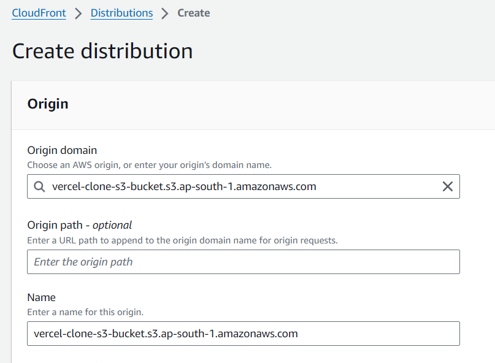
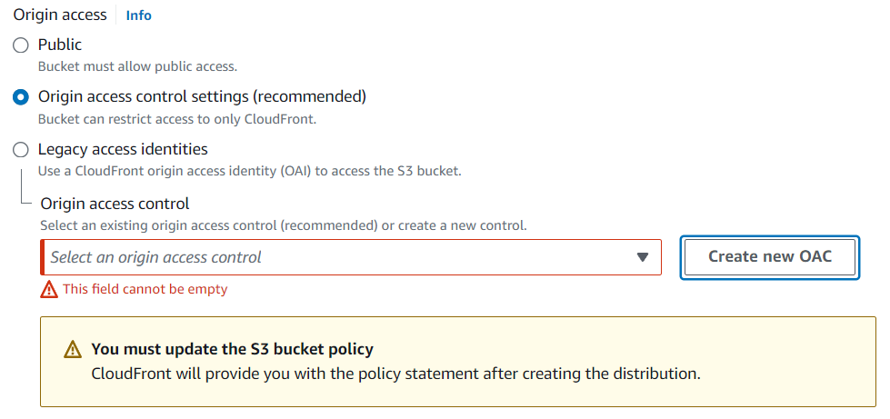
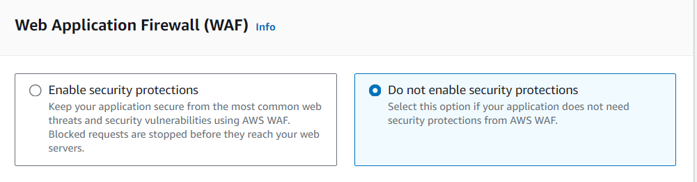
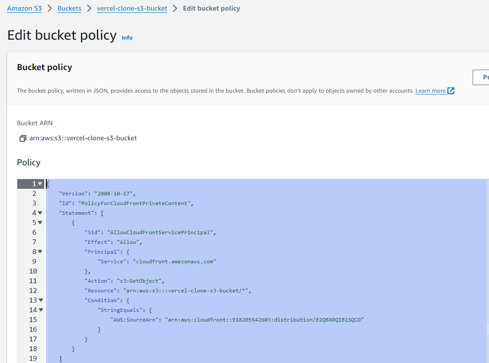
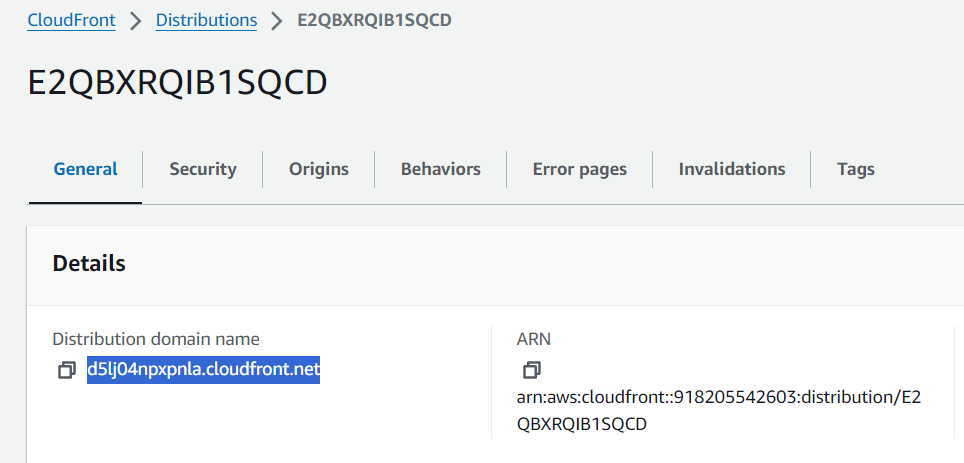
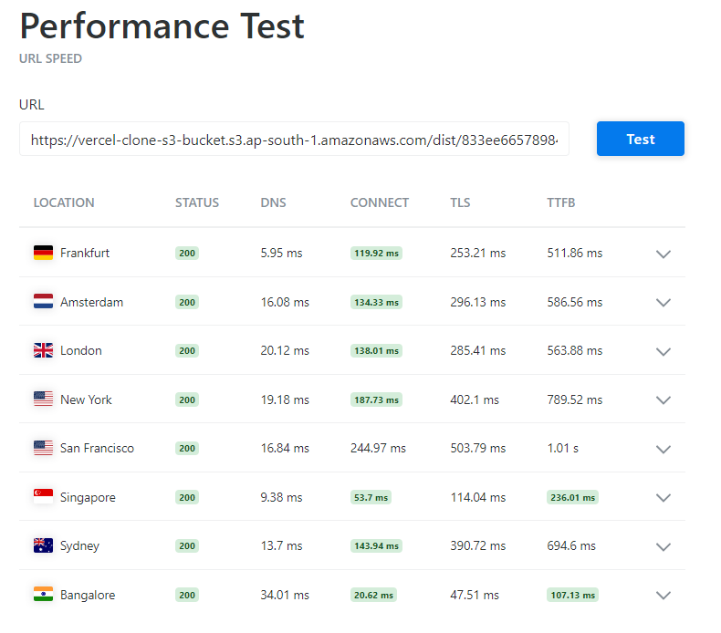
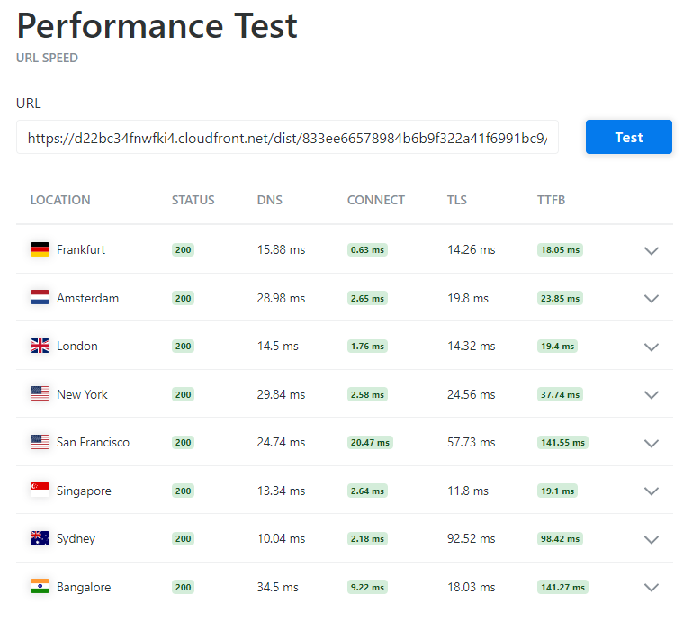
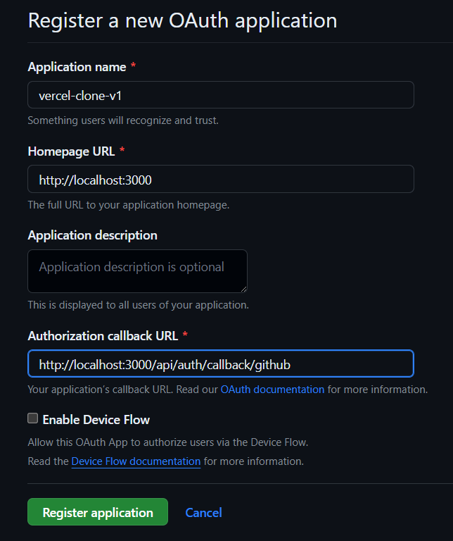
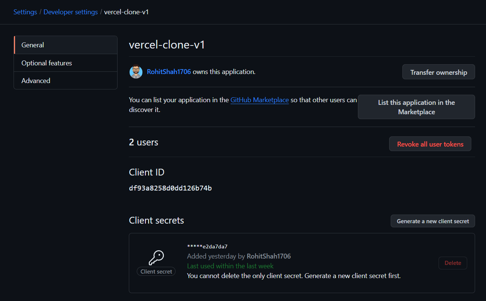

## Use commitlint to adhere to a commit convention.

[Guild: Local Setup with commitlint](https://commitlint.js.org/#/guides-local-setup?id=install-commitlint)

1. Install commitlint

```powershell
# Install and configure commitlint cli
npm install --save-dev @commitlint/config-conventional @commitlint/cli

# Create & add this to commitlint.config.js file
module.exports = { extends: ['@commitlint/config-conventional'] };
```

2. Install husky

```powershell
# Install Husky v6
npm install husky --save-dev

# Activate hooks
npx husky install
```

3. Add hook

```powershell
npm pkg set scripts.commitlint="commitlint --edit"
npx husky add .husky/commit-msg 'npm run commitlint ${1}'
```

4. Commit with this convention: [Commit lint conventions](https://github.com/conventional-changelog/commitlint?tab=readme-ov-file#what-is-commitlint)

```powershell
git commit -m "chore: lint on commitmsg"
```

---

## Initialize an empty typescript project

```bash
npx tsc --init
```

Update `tsconfig.json` file configurations:

```json
{
	"compilerOptions": {
		"rootDir": "./src",
		"outDir": "./dist"
	}
}
```

```bash
npm i -D ts-node nodemon
```

Add in `package.json` file the following script to create dev server:

```json
	"scripts": {
		"dev": "nodemon --exec ts-node src/index.ts"
	},
```

---

## Setting up Primea with PostgreSQL

**Reference**: [Prisma Docs - QuickStart](https://www.prisma.io/docs/getting-started/quickstart)

```bash
npx tsc --init
npm install prisma --save-dev

# Setup Prisma ORM with PostgreSQL
npx prisma init --datasource-provider postgresql
```

---

## Setting up AWS S3 bucket for file uploading

1. Create S3 bucket & Extract the `bucket name` and `region`

   

   ```env
   AWS_S3_BUCKET_NAME=vercel-clone-s3-bucket
   AWS_S3_BUCKET_REGION=ap-south-1
   ```

2. Create IAM user with S3 full access to our `vercel-clone-s3-bucket` bucket.

   
   
   
   
   

**Final policy should look like this**:

```json
{
	"Version": "2012-10-17",
	"Statement": [
		{
			"Sid": "AllowWebAccess",
			"Effect": "Allow",
			"Principal": "*",
			"Action": "s3:GetObject",
			"Resource": [
				"arn:aws:s3:::vercel-clone-s3-bucket/dist/*",
				"arn:aws:s3:::vercel-clone-s3-bucket/404/*"
			]
		}
	]
}
```

3. Create `access key` and `secret key` for the user.

   
   
   

---

## Setting up AWS CloudFront for CDN with S3 as origin

1. Create S3 bucket and disable public access since we want to serve files via CloudFront only.

2. Create CloudFront distribution with S3 bucket as origin.

   

3. Since our S3 bucket is private, we need to create an `OAC` (Origin Access Control) to allow only CloudFront to access the S3 bucket.

   
   

4. Copy the OCA that is generated and paste it in the S3 bucket policy.

   

5. Copy the CloudFront domain name and use it to access the files in the S3 bucket instead of the S3 bucket URL.

   

**NOTE**: The endpoint URL to access files will now change:

```env
# old endpoint URL
AWS_S3_BASE_URL=https://vercel-clone-s3-bucket.s3.ap-south-1.amazonaws.com

# new endpoint URL
AWS_S3_BASE_URL=https://d5lj04npxpnla.cloudfront.net
```

**Benefits of using CloudFront**:

1. **Improved Performance**: It caches content at edge locations around the world, reducing the distance to the end user and improving load times.

2. **Scalability**: CloudFront can handle traffic spikes and high load times without requiring manual intervention, making it easier to scale your application.

3. **Security**: CloudFront provides several security features, including AWS Shield for DDoS protection, AWS WAF for protecting against common web exploits, and field-level encryption for sensitive data.

---

## Performance comparison of serving files from S3 bucket v/s from CloudFront

**Reference**: [KeyCDN for Performance testing](https://tools.keycdn.com/performance)

**TTFB**: time to first byte, the time between the client making a request and the server responding

**S3 Performance**:  


**CloudFront Performance**:


---

## Setting up AWS S3 bucket locally with LocalStack

**References**:

1. [Setup AWS S3 bucket locally with LocalStack](https://dev.to/navedrizv/setup-aws-s3-bucket-locally-with-localstack-3n4o)
2. [Using Localstack to Emulate AWS S3 and SQS With Node](https://iamads.medium.com/using-localstack-emulate-aws-s3-and-sqs-with-node-d43dda1d71c0)

**Steps taken**:

1. Install and start LocalStack

```bash
# Install LocalStack
pip install localstack

# Start LocalStack in docker mode, from a container
localstack start -d

# Install awslocal, which is a thin wrapper around the AWS CLI that allows you to access LocalStack
pip install awscli-local
```

2. Create a new Local AWS Profile (called "localstack") to work with LocalStack

```bash
PS D:\Projects\Vercel Clone> aws configure --profile localstack
AWS Access Key ID [None]: test
AWS Secret Access Key [None]: test
Default region name [None]: ap-south-1
Default output format [None]:
```

3. Check if the profile is created

```bash
PS D:\Projects\Vercel Clone> aws configure list --profile localstack
      Name                    Value             Type    Location
      ----                    -----             ----    --------
   profile               localstack           manual    --profile
access_key     ****************test shared-credentials-file
secret_key     ****************test shared-credentials-file
    region               ap-south-1      config-file    ~/.aws/config
```

4. Create S3 bucket ("vercel-clone-s3-bucket") with "localstack" profile using awslocal

```bash
# awslocal s3api create-bucket --bucket vercel-clone-s3-bucket --
profile localstack
aws s3 mb s3://vercel-clone-s3-bucket --endpoint-url http://localhost:4566 --profile localstack

# List all buckets
aws s3 ls --endpoint-url http://localhost:4566 --profile localstack
```

5. List all files inside some bucket/<id> - here <id> comes after "upload-service" uploads the files to S3

```bash
aws s3 ls s3://vercel-clone-s3-bucket/clonedRepos/5b2abda7e18543df85f8d84814dda19f --recursive --endpoint-url http://localhost:4566 --profile localstack
```

---

## Setup OAuth2.0 for github login using NextAuth.js

**References**:

1. [Next-Auth on App Router - Solid Auth, Super Fast](https://www.youtube.com/watch?v=md65iBX5Gxg)
2. [NextAuth.js - Authentication for Next.js](https://next-auth.js.org/)

**Steps taken**:

1. Navigate to [GitHub Developer Settings](https://github.com/settings/developers) and create a new OAuth app.

   

2. Note that `Authorization callback URL` is `http://localhost:3000/api/auth/callback/github` which is the default callback URL for NextAuth.js. Checkout `frontend/app/api/auth/[...nextauth]/route.js` & `frontend/app/pages/api/auth/[...nextauth]/options.js` where we register our Github OAuth provider.

3. Get the `CLIENT_ID` and `CLIENT_SECRET` variables.

   

**NOTE**: By default NextAuth.js only asks for `user:email` scope. But we want to generate an `access_token` to also access private repositories in `upload-service`. So we override the default scope in `options.js` file.

```javascript
import GitHubProvider from "next-auth/providers/github";

export const options = {
	providers: [
		GitHubProvider({
			clientId: process.env.GITHUB_CLIENT_ID,
			clientSecret: process.env.GITHUB_CLIENT_SECRET,
			// ! IMP: used to set the scope of the access token
			// ! below will provide complete access to all repos
			authorization: {
				params: {
					scope: "repo user",
				},
			},
		}),
	],
	session: {
		// ! IMP: session data is stored directly in a JWT token
		strategy: "jwt",
		maxAge: 60 * 60 * 1, // ! one hour
	},
	callbacks: {
		jwt: async ({token, user, account}) => {
			if (account && account.access_token) {
				token.accessToken = account.access_token;
			}
			return token;
		},
	},
};
```

**NOTE**: By default, NextAuth.js won't provide the `access_token` in the `session` object. So we have to manually add it in the `jwt` callback. Now, we can extract the `access_token` from the `session` object in the frontend and send it to the backend (`upload-service`) to access private repositories.

---

## Errors faced

### Have to use `Promise.all` to wait for all files to be uploaded to S3 before pushing to Redis queue

In the below code seems like all files will first be uploaded to the S3 bucket and then the id will be pushed to the redis queue. But the problem is that the `forEach` does not wait for promises. So even though we're using `await` inside `forEach` callback, it only make the callback itself asynchronous, not the `forEach` loop, meaning `console.log` after `uploadFile` will be executed only when that particular file is uploaded to S3, but `publisher.lPush` will be executed immediately after the `forEach` loop is finished.

**Problem**:

```javascript
files.forEach(async (file) => {
	await uploadFile(file.slice(__dirname.length + 1), file);
	// console.log(`File ${file} uploaded to S3`);
});

// ! put the id on the redis "build-queue" for deploy-service to consume
publisher.lPush("build-queue", id);
```

**Solution**:

```javascript
await Promise.all(
	files.map((file) => {
		return uploadFile(file.slice(__dirname.length + 1), file);
	})
);

// Now all files have been uploaded, so we can push to the Redis queue
publisher.lPush("build-queue", id);
```

### Have to use hostname/<id> instead of id.hostname.com

<!-- ! all this cuz we don't have our domain name -->

To update in dist after build is done
Add /fcd2d166fac040b6aca85c0df529b5bd or /<id> before keyword

1. INDEX.HTML FILE "/assets/" -> "/fcd2d166fac040b6aca85c0df529b5bd/assets/"
2. INDEX.HTML FILE "/assets/" -> "/fcd2d166fac040b6aca85c0df529b5bd/assets/"
3. ASSETS/\*.JS FILE "/assets/" -> "/<id>/assets/"

### Downloading files from S3 in Chunks

**Reference**: [Upload or download large files to and from Amazon S3 using an AWS SDK](https://docs.aws.amazon.com/AmazonS3/latest/userguide/example_s3_Scenario_UsingLargeFiles_section.html)

Breaking down a large file into smaller pieces, or _chunking_, has several benefits:

1. **Improved reliability**: If a download fails, we only need to retry the failed chunk, not the entire file.

2. **Parallel downloads**: We can download multiple chunks simultaneously, which can significantly speed up the download process if we have a high-bandwidth connection.

3. **Lower memory usage**: When downloading a file in one piece, the entire file needs to be held in memory, which can be a problem for large files. By downloading in chunks, we only need to hold one chunk in memory at a time.

**NOTE**: Checkout `deploy-service/src/downloadInChunks.ts` for implementation.

---

## Todos

### Rotate SECRET_KEY

**Possible implementation**:

```javascript
const mongoClient = require("mongodb").MongoClient;
const url = "mongodb://localhost:27017";
const dbName = "myproject";

// Connect to MongoDB
mongoClient.connect(url, function (err, client) {
	const db = client.db(dbName);
	const collection = db.collection("envVars");

	// Retrieve all envVars
	collection.find({}).toArray(function (err, docs) {
		docs.forEach((doc) => {
			// Decrypt envVars using old key
			const decrypted = decrypt(doc.envVars, oldKey);

			// Encrypt envVars using new key
			const encrypted = encrypt(decrypted, newKey);

			// Update envVars in MongoDB
			collection.updateOne({_id: doc._id}, {$set: {envVars: encrypted}});
		});
	});

	client.close();
});
```

### Maintain common files for different services in a separate folder

Those files include:

- `src/config/index.ts`
- `src/connection/*`
- `src/controllers/*`
- `src/models/*`
- `src/cryptoUtis.ts`
- `src/file.ts`

TODO: remove all unused imports for each service
TODO: create middleware as current middleware allow access to anybody's projects if you have a valid github access token
TODO: shift to postgresql & primsa for database
TODO: see how to create hooks using Octokit
TODO: use prisma studio to visualize database in the browser
TODO: shift to RabbitMQ/kafka for publishing tasks
TODO: use redis only as caching layer: remove publish tasks & status onto queue
TODO: add getOrSetCache function & use redis as caching: for /status of "upload-server"
TODO: use kafka to stream build logs from "deploy-service"
TODO: create "kafka-consumer" service to consume build logs from "deploy-service" & push to clickhouse
TODO: can use postgresql for storing build logs but clickhouse is faster
TODO: use clickhouse - fast open-source OLAP database management system for real-time push of build logs from "deploy-service"
TODO: use polling on frontend to get build logs from "upload-service" (which will get from clickhouse) & display in real-time
TODO: create frontend basic template

---

## References, Blogs & Resources used

1. [Behind the scenes of Vercel's infrastructure: Achieving optimal scalability and performance](https://vercel.com/blog/behind-the-scenes-of-vercels-infrastructure)

2. [Learn Prisma In 60 Minutes - Web Dev Simplified](https://www.youtube.com/watch?v=RebA5J-rlwg)
3. [Prisma Docs - QuickStart](https://www.prisma.io/docs/getting-started/quickstart)

4. [Setup AWS S3 bucket locally with LocalStack](https://dev.to/navedrizv/setup-aws-s3-bucket-locally-with-localstack-3n4o)

5. [Using Localstack to Emulate AWS S3 and SQS With Node](https://iamads.medium.com/using-localstack-emulate-aws-s3-and-sqs-with-node-d43dda1d71c0)

6. [Next-Auth on App Router - Solid Auth, Super Fast](https://www.youtube.com/watch?v=md65iBX5Gxg)

7. [NextAuth.js - Authentication for Next.js](https://next-auth.js.org/)

8. [Upload or download large files to and from Amazon S3 using an AWS SDK](https://docs.aws.amazon.com/AmazonS3/latest/userguide/example_s3_Scenario_UsingLargeFiles_section.html)

9. [KeyCDN for Performance testing](https://tools.keycdn.com/performance)

---
