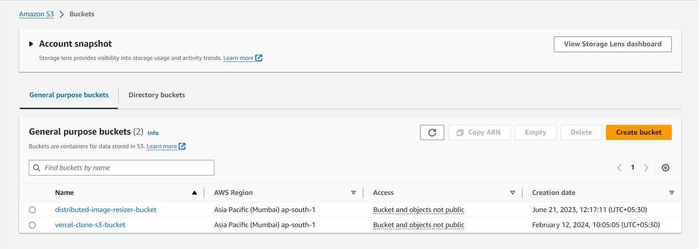
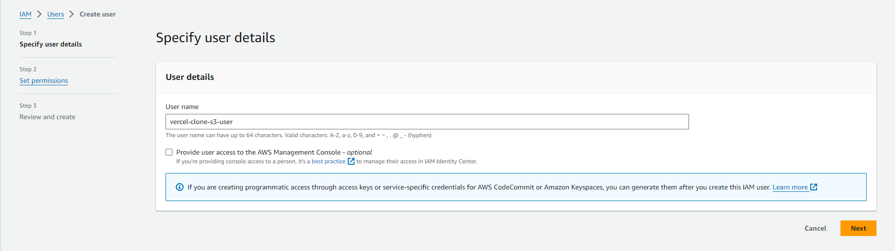
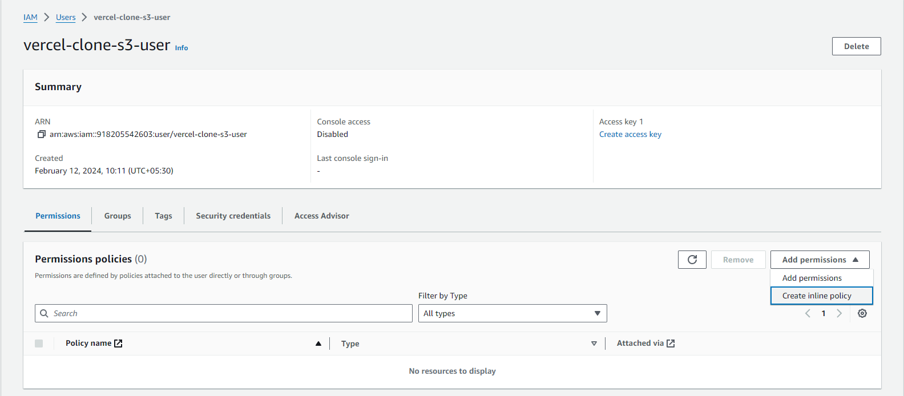
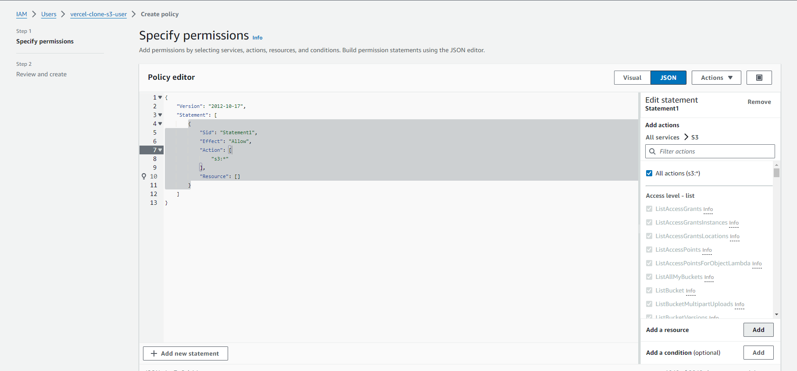
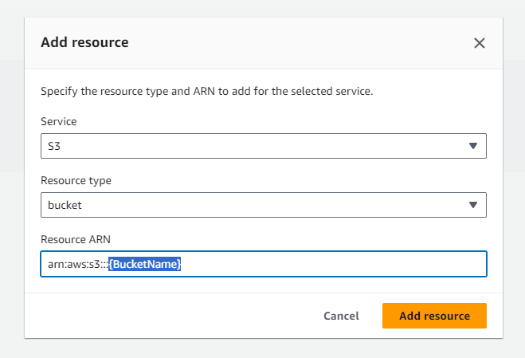
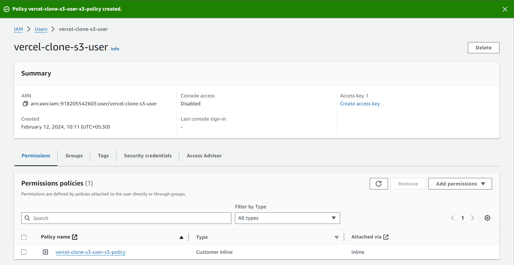
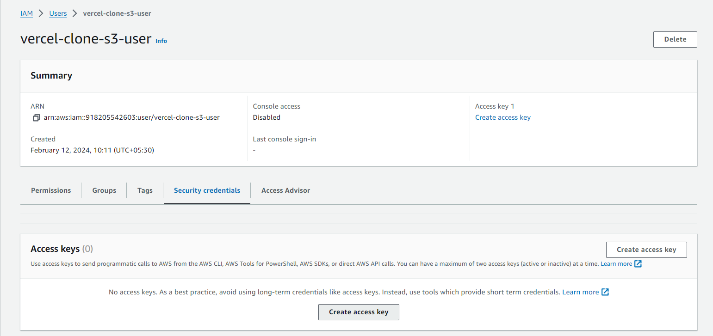
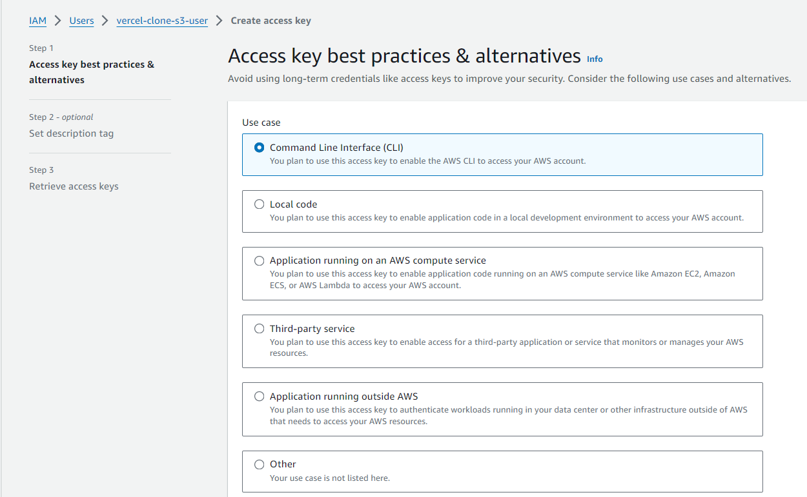
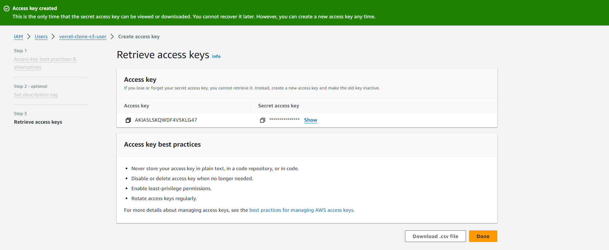

## Use commitlint to adhere to a commit convention.

[Guild: Local Setup with commitlint](https://commitlint.js.org/#/guides-local-setup?id=install-commitlint)

1. Install commitlint

```powershell
# Install and configure commitlint cli
npm install --save-dev @commitlint/config-conventional @commitlint/cli

# Create & add this to commitlint.config.js file
module.exports = { extends: ['@commitlint/config-conventional'] };
```

2. Install husky

```powershell
# Install Husky v6
npm install husky --save-dev

# Activate hooks
npx husky install
```

3. Add hook

```powershell
npm pkg set scripts.commitlint="commitlint --edit"
npx husky add .husky/commit-msg 'npm run commitlint ${1}'
```

4. Commit with this convention: [Commit lint conventions](https://github.com/conventional-changelog/commitlint?tab=readme-ov-file#what-is-commitlint)

```powershell
git commit -m "chore: lint on commitmsg"
```

---

## Setting up AWS S3 bucket for file uploading

1. Create S3 bucket & Extract the `bucket name` and `region`

   

   ```env
   AWS_S3_BUCKET_NAME=vercel-clone-s3-bucket
   AWS_S3_BUCKET_REGION=ap-south-1
   ```

2. Create IAM user with S3 full access to our `vercel-clone-s3-bucket` bucket.

   
   
   
   
   

**Final policy should look like this**:

```json
{
	"Version": "2012-10-17",
	"Statement": [
		{
			"Sid": "Statement1",
			"Effect": "Allow",
			"Action": ["s3:*"],
			"Resource": [
				"arn:aws:s3:::vercel-clone-s3-bucket",
				"arn:aws:s3:::vercel-clone-s3-bucket/*"
			]
		}
	]
}
```

3. Create `access key` and `secret key` for the user.

   
   
   

---
