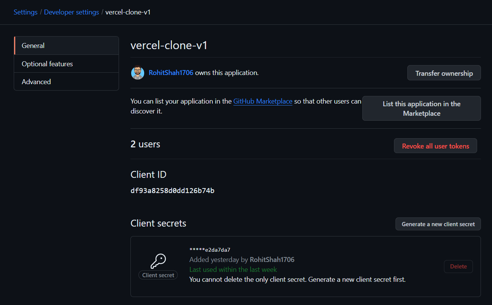
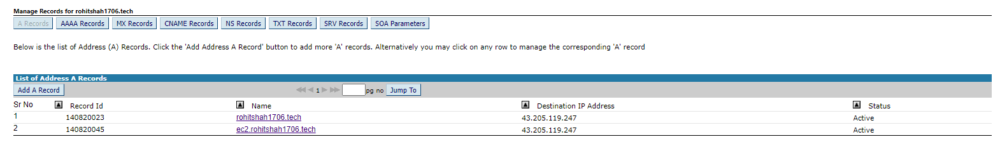

# Vercel Clone V1

This project is a platform designed to enable seamless deployment of frontend applications across various JavaScript frameworks and libraries. It provides users with a streamlined deployment process, integrating directly with GitHub repositories for effortless deployment with a single click. The project employs containerized deployment strategies and leverages AWS S3 with CloudFront to achieve exceptional performance, reducing latency by up to 90%. The system employs an asynchronous architecture for efficient deployment task queuing and processing, ensuring scalability and reliability. Additionally, it utilizes Kafka for real-time streaming of build logs, ensuring efficient and scalable deployment processes.

---

## Architecture

**Upload-Service**:

- Clones GitHub Repositories.
- Uploads source code to AWS S3.
- Triggers build tasks via Kafka.

**Deploy-Service**:

- Consumes build tasks from Kafka.
- Executes builds and deploys to AWS S3.
- Streams build logs via Kafka.

**Frontend**:

- Notifies users of build status.
- Routes requests through AWS CloudFront for low-latency delivery.

---

## Technologies Used

1. [TypeScript](https://www.typescriptlang.org/)
2. [Express JS](https://expressjs.com/)
3. [Next JS](https://nextjs.org/)
4. [PostgreSQL](https://www.postgresql.org/)
5. [Prisma](https://www.prisma.io/)
6. [Docker](https://www.docker.com/)
7. [Redis](https://redis.io/)
8. [Kafka](https://kafka.apache.org/)
9. AWS services (S3, CloudFront)

---

## Initialize an empty typescript project

```bash
npx tsc --init
```

Update `tsconfig.json` file configurations:

```json
{
	"compilerOptions": {
		"rootDir": "./src",
		"outDir": "./dist"
	}
}
```

```bash
npm i -D ts-node nodemon
```

Add in `package.json` file the following script to create dev server:

```json
	"scripts": {
		"dev": "nodemon --exec ts-node src/index.ts"
	},
```

---

## Setting up Prisma with PostgreSQL

**Reference**: [Prisma Docs - QuickStart](https://www.prisma.io/docs/getting-started/quickstart)

```bash
npx tsc --init
npm install prisma --save-dev

# Setup Prisma ORM with PostgreSQL
npx prisma init --datasource-provider postgresql
```

---

## Setting up AWS S3 bucket for file uploading

1. Create S3 bucket & Extract the `bucket name` and `region`

   

   ```env
   AWS_S3_BUCKET_NAME=vercel-clone-s3-bucket
   AWS_S3_BUCKET_REGION=ap-south-1
   ```

2. Create IAM user with S3 full access to our `vercel-clone-s3-bucket` bucket.

   
   
   
   
   

**Final policy should look like this**:

```json
{
	"Version": "2012-10-17",
	"Statement": [
		{
			"Sid": "AllowWebAccess",
			"Effect": "Allow",
			"Principal": "*",
			"Action": "s3:GetObject",
			"Resource": [
				"arn:aws:s3:::vercel-clone-s3-bucket/dist/*",
				"arn:aws:s3:::vercel-clone-s3-bucket/404/*"
			]
		}
	]
}
```

3. Create `access key` and `secret key` for the user.

   
   
   

---

## Setting up AWS CloudFront for CDN with S3 as origin

1. Create S3 bucket and disable public access since we want to serve files via CloudFront only.

2. Create CloudFront distribution with S3 bucket as origin.

   

3. Since our S3 bucket is private, we need to create an `OAC` (Origin Access Control) to allow only CloudFront to access the S3 bucket.

   
   

4. Copy the `OAC` (Origin Access Control) that is generated and paste it in the S3 bucket policy.

   

5. Copy the CloudFront domain name and use it to access the files in the S3 bucket instead of the S3 bucket URL.

   

**NOTE**: The endpoint URL to access files will now change:

```env
# old endpoint URL
AWS_S3_BASE_URL=https://vercel-clone-s3-bucket.s3.ap-south-1.amazonaws.com

# new endpoint URL
AWS_S3_BASE_URL=https://d5lj04npxpnla.cloudfront.net
```

**Benefits of using CloudFront**:

1. **Improved Performance**: It caches content at edge locations around the world, reducing the distance to the end user and improving load times.

2. **Scalability**: CloudFront can handle traffic spikes and high load times without requiring manual intervention, making it easier to scale your application.

3. **Security**: CloudFront provides several security features, including AWS Shield for DDoS protection, AWS WAF for protecting against common web exploits, and field-level encryption for sensitive data.

---

## Performance comparison of serving files from S3 bucket v/s from CloudFront

**Reference**: [KeyCDN for Performance testing](https://tools.keycdn.com/performance)

**TTFB**: time to first byte, the time between the client making a request and the server responding

**S3 Performance**:  


**CloudFront Performance**:


---

## Setting up AWS S3 bucket locally with LocalStack

**References**:

1. [Setup AWS S3 bucket locally with LocalStack](https://dev.to/navedrizv/setup-aws-s3-bucket-locally-with-localstack-3n4o)
2. [Using Localstack to Emulate AWS S3 and SQS With Node](https://iamads.medium.com/using-localstack-emulate-aws-s3-and-sqs-with-node-d43dda1d71c0)

**Steps taken**:

1. Install and start LocalStack

```bash
# Install LocalStack
pip install localstack

# Start LocalStack in docker mode, from a container
localstack start -d

# Install awslocal, which is a thin wrapper around the AWS CLI that allows you to access LocalStack
pip install awscli-local
```

2. Create a new Local AWS Profile (called "localstack") to work with LocalStack

```bash
PS D:\Projects\Vercel Clone> aws configure --profile localstack
AWS Access Key ID [None]: test
AWS Secret Access Key [None]: test
Default region name [None]: ap-south-1
Default output format [None]:
```

3. Check if the profile is created

```bash
PS D:\Projects\Vercel Clone> aws configure list --profile localstack
      Name                    Value             Type    Location
      ----                    -----             ----    --------
   profile               localstack           manual    --profile
access_key     ****************test shared-credentials-file
secret_key     ****************test shared-credentials-file
    region               ap-south-1      config-file    ~/.aws/config
```

4. Create S3 bucket ("vercel-clone-s3-bucket") with "localstack" profile using awslocal

```bash
aws s3 mb s3://vercel-clone-s3-bucket --endpoint-url http://localhost:4566 --profile localstack

# List all buckets
aws s3 ls --endpoint-url http://localhost:4566 --profile localstack
```

5. List all files inside some bucket/<id> - here <id> comes after "upload-service" uploads the files to S3

```bash
aws s3 ls s3://vercel-clone-s3-bucket/clonedRepos/5b2abda7e18543df85f8d84814dda19f --recursive --endpoint-url http://localhost:4566 --profile localstack
```

---

## Setup OAuth2.0 for github login using NextAuth.js

**References**:

1. [Next-Auth on App Router - Solid Auth, Super Fast](https://www.youtube.com/watch?v=md65iBX5Gxg)
2. [NextAuth.js - Authentication for Next.js](https://next-auth.js.org/)

**Steps taken**:

1. Navigate to [GitHub Developer Settings](https://github.com/settings/developers) and create a new OAuth app.

   

2. Note that `Authorization callback URL` is `http://localhost:3000/api/auth/callback/github` which is the default callback URL for NextAuth.js. Checkout `frontend/app/api/auth/[...nextauth]/route.js` & `frontend/app/pages/api/auth/[...nextauth]/options.js` where we register our Github OAuth provider.

3. Get the `CLIENT_ID` and `CLIENT_SECRET` variables.

   

**NOTE**: By default NextAuth.js only asks for `user:email` scope. But we want to generate an `access_token` to also access private repositories in `upload-service`. So we override the default scope in `options.js` file.

```javascript
import GitHubProvider from "next-auth/providers/github";

export const options = {
	providers: [
		GitHubProvider({
			clientId: process.env.GITHUB_CLIENT_ID,
			clientSecret: process.env.GITHUB_CLIENT_SECRET,
			// ! IMP: used to set the scope of the access token
			// ! below will provide complete access to all repos
			authorization: {
				params: {
					scope: "repo user",
				},
			},
		}),
	],
	session: {
		// ! IMP: session data is stored directly in a JWT token
		strategy: "jwt",
		maxAge: 60 * 60 * 1, // ! one hour
	},
	callbacks: {
		jwt: async ({ token, user, account }) => {
			if (account && account.access_token) {
				token.accessToken = account.access_token;
			}
			return token;
		},
	},
};
```

**NOTE**: By default, NextAuth.js won't provide the `access_token` in the `session` object. So we have to manually add it in the `jwt` callback. Now, we can extract the `access_token` from the `session` object in the frontend and send it to the backend (`upload-service`) to access private repositories.

---

## SSL Certificate Setup and Deployment

**References**:

1. [Deploy a Node.js Application on AWS EC2 with Nginx with SSL](https://medium.com/@chiragmehta900/deploy-a-node-js-application-on-aws-ec2-with-nginx-with-ssl-47fb163d0909)

2. [How To Use Certbot Standalone Mode to Retrieve Let's Encrypt SSL Certificates on Ubuntu 20.04](https://www.digitalocean.com/community/tutorials/how-to-use-certbot-standalone-mode-to-retrieve-let-s-encrypt-ssl-certificates-on-ubuntu-20-04)

**Steps taken**:

1. Added A records for the subdomain ec2.rohitshah1706.tech pointing to the EC2 instance's IP address (e.g., 43.205.119.247).

   

2. Verify the A record using `nslookup` command to check if the subdomain is pointing to the correct IP address.

```bash
nslookup ec2.rohitshah1706.tech

# Output
Server:  one.one.one.one
Address:  1.1.1.1

Non-authoritative answer:
Name:    ec2.rohitshah1706.tech
Address:  43.205.119.247
```

3. Update Nginx Configurations to setup a reverse proxy & redirect our application to port 3000 (for this example). Edit the file at `/etc/nginx/sites-available/default`

```nginx
server {
	server_name ec2.rohitshah1706.tech;

	location / {
		proxy_pass http://localhost:3000;
		proxy_http_version 1.1;
		proxy_set_header Upgrade $http_upgrade;
		proxy_set_header Connection 'upgrade';
		proxy_set_header Host $host;
		proxy_cache_bypass $http_upgrade;
	}
}
```

4. Verify the Nginx configuration and restart the Nginx service.

```bash
# Verify the Nginx configuration
sudo nginx -t

# Restart the Nginx service
sudo systemctl restart nginx
```

5. Install Certbot and request a new SSL certificate for the subdomain.

```bash
# Install snapd
sudo apt-get update
sudo snap install core
sudo snap refresh core

# Remove the certbot old version if installed
sudo apt-get remove certbot

# Install certbot
sudo snap install --classic certbot

# Link - create a symlink to the new version
sudo ln -s /snap/bin/certbot /usr/bin/certbot

# Running Certbot with the --nginx plugin
# will take care of reconfiguring Nginx
# and reloading the config whenever necessary
sudo certbot --nginx
```

6. Run a basic http server on port 3000 to check if our subdomain is now accessible via HTTPS.

**NOTE**: make sure that EC2 instance security group allows traffic on port 443 for https.

---

## Downloading files from S3 in Chunks

**Reference**: [Upload or download large files to and from Amazon S3 using an AWS SDK](https://docs.aws.amazon.com/AmazonS3/latest/userguide/example_s3_Scenario_UsingLargeFiles_section.html)

Breaking down a large file into smaller pieces, or _chunking_, has several benefits:

1. **Improved reliability**: If a download fails, we only need to retry the failed chunk, not the entire file.

2. **Parallel downloads**: We can download multiple chunks simultaneously, which can significantly speed up the download process if we have a high-bandwidth connection.

3. **Lower memory usage**: When downloading a file in one piece, the entire file needs to be held in memory, which can be a problem for large files. By downloading in chunks, we only need to hold one chunk in memory at a time.

**NOTE**: Checkout `deploy-service/src/downloadInChunks.ts` for implementation.

---

## References, Blogs & Resources used

1. [Behind the scenes of Vercel's infrastructure: Achieving optimal scalability and performance](https://vercel.com/blog/behind-the-scenes-of-vercels-infrastructure)

2. [Learn Prisma In 60 Minutes - Web Dev Simplified](https://www.youtube.com/watch?v=RebA5J-rlwg)
3. [Prisma Docs - QuickStart](https://www.prisma.io/docs/getting-started/quickstart)

4. [Setup AWS S3 bucket locally with LocalStack](https://dev.to/navedrizv/setup-aws-s3-bucket-locally-with-localstack-3n4o)

5. [Using Localstack to Emulate AWS S3 and SQS With Node](https://iamads.medium.com/using-localstack-emulate-aws-s3-and-sqs-with-node-d43dda1d71c0)

6. [Next-Auth on App Router - Solid Auth, Super Fast](https://www.youtube.com/watch?v=md65iBX5Gxg)

7. [NextAuth.js - Authentication for Next.js](https://next-auth.js.org/)

8. [Upload or download large files to and from Amazon S3 using an AWS SDK](https://docs.aws.amazon.com/AmazonS3/latest/userguide/example_s3_Scenario_UsingLargeFiles_section.html)

9. [KeyCDN for Performance testing](https://tools.keycdn.com/performance)

10. SSL Certificate Setup and Deployment: (refer to [section](#ssl-certificate-setup-and-deployment) for more details)

    - [Deploy a Node.js Application on AWS EC2 with Nginx with SSL](https://medium.com/@chiragmehta900/deploy-a-node-js-application-on-aws-ec2-with-nginx-with-ssl-47fb163d0909)

    - [How To Use Certbot Standalone Mode to Retrieve Let's Encrypt SSL Certificates on Ubuntu 20.04](https://www.digitalocean.com/community/tutorials/how-to-use-certbot-standalone-mode-to-retrieve-let-s-encrypt-ssl-certificates-on-ubuntu-20-04)

11. [Next.js Server Actions & 5 awesome things you can do](https://www.youtube.com/watch?v=O94ESaJtHtM)

12. [Node Typescript Project Dockerfile](https://www.emmanuelgautier.com/blog/snippets/typescript-dockerfile)

13. Apache Kafka:

    - [Apache Kafka in 6 minutes](https://www.youtube.com/watch?v=Ch5VhJzaoaI)

    - [System Design: Why is Kafka fast?](https://www.youtube.com/watch?v=UNUz1-msbOM)

---
